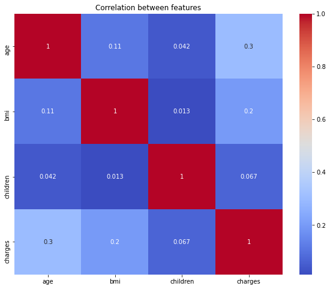

# Healthcare Insurance Charge Project

Author: [Victor Masinde](https://github.com/Masinde10)

### **1. Project Overview**  
Healthcare is a fundamental human need, and insurance companies play a vital role in ensuring accessibility to medical care. This project aims to analyze and predict **medical insurance charges** based on various demographic and health-related factors such as **age, BMI, smoking status, region, and number of children**. Using **machine learning models**, we seek to understand which factors influence insurance costs the most and develop an accurate predictive model.  

### **2. Problem Statement**  
Insurance companies need a reliable way to estimate the **expected medical charges** for their clients based on various attributes. However, these charges vary widely depending on factors like **age, BMI, smoking habits, and geographic location**. This project seeks to address the following key questions:  
- What are the most significant factors affecting insurance charges?  
- Can we develop a **predictive model** that accurately estimates a person's medical expenses?  
- How can insurance companies leverage data insights to adjust premiums more effectively?  

### **3. Objectives**  
The primary goals of this project are:  
1. **Analyze** the dataset to understand key trends and correlations between variables.  
2. **Clean and preprocess** the data to handle missing values, categorical variables, and outliers.  
3. **Build machine learning models** (e.g., Linear Regression, Decision Trees, Random Forest) to predict medical charges.  
4. **Evaluate model performance** using metrics like **Mean Absolute Error (MAE)** and **Root Mean Squared Error (RMSE)**.  
5. **Interpret results** to provide meaningful insights for insurance companies.  

### **4. Stakeholders**  
This project is beneficial to multiple stakeholders, including:  
- **Insurance Companies** – To optimize pricing strategies and predict claim costs.  
- **Customers** – To understand what factors influence their insurance costs.  
- **Healthcare Providers** – To identify cost trends and potential risk factors for patients.  

### **Data Understanding**
The dataset, `insurance.csv` used for this project is sourced from kaggle where it is made public for everyone. The dataset has 1338 rows and 7 columns namely; `age,sex,bmi,children,smoker,region and charges`. There are three columns with their data types as objects, two as intergers and two as float.

### **Data Cleaning**
In this section We are checking to see if my data has mising `values` and `duplicates`. I will drop duplicates if they are present and fill the null values if present.  Filling missing data with `mean for continous data` and `Mode for categorical data` will be strategy to use. There are no missing values in our data but a duplicate existed in `row 581`. Drop the duplicated row.

### **Exploratory Data Analysis**
In this section we check the relationships that exist between our features and this helps us understand our data even more. From the analysis, we see that there are more males than females in our sample. There is a high number of people without children and the number reduces uniformly to those with five children. The correlation between charges and age is high while that of charge and the number of children is low. The number of non-Smokers is higher than those who smoke. There is a positive correlation between BMI and charges as seen in the scatter plot diagram

- BMI scatter plot

- Number of children per person

- Distribution of smokers

- Correlation heatmap
